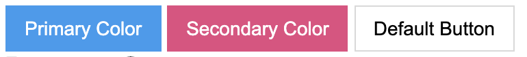
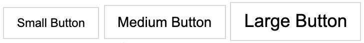
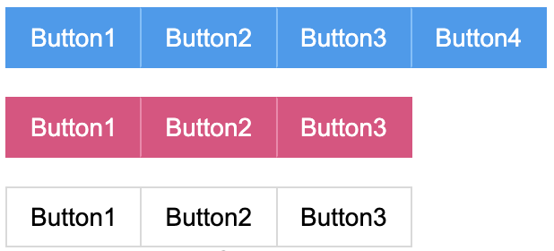
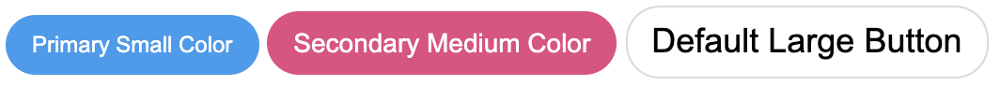

# common_css

공통적으로 사용할 CSS 파일 저장소

# Document

## Button Component

### Button Color

버튼은 아래 3가지를 지원한다.

- primary: `.btn-primary`
- secondary: `.btn-secondary`
- default: `.btn-default`

**Sample**



```html
<button class="btn btn-md btn-primary">Primary Color</button>
<button class="btn btn-md btn-secondary">Secondary Color</button>
<button class="btn btn-md btn-default">Default Button</button>
```

### Button Size

버튼 사이즈는 3가지를 지원한다.

- small: `.btn-sm`
- medium: `.btn-md`
- large: `.btn-lg`

**Sample**



```html
<button class="btn btn-sm btn-default">Small Button</button>
<button class="btn btn-md btn-default">Medium Button</button>
<button class="btn btn-lg btn-default">Large Button</button>
```

### Button Group

여러개의 버튼을 `.btn-group` 을 이용하여 그룹화 할 수 있다.

**Sample**



```html
<div class="btn-group">
  <button class="btn btn-md btn-primary">Button1</button>
  <button class="btn btn-md btn-primary">Button2</button>
  <button class="btn btn-md btn-primary">Button3</button>
  <button class="btn btn-md btn-primary">Button4</button>
</div>
<br />
<div class="btn-group">
  <button class="btn btn-md btn-secondary">Button1</button>
  <button class="btn btn-md btn-secondary">Button2</button>
  <button class="btn btn-md btn-secondary">Button3</button>
</div>
<br />
<div class="btn-group">
  <button class="btn btn-md btn-default">Button1</button>
  <button class="btn btn-md btn-default">Button2</button>
  <button class="btn btn-md btn-default">Button3</button>
</div>
```

### Button Radius

버튼의 모서리를 `.btn-radius` 를 이용하여 둥글게 할 수 있다.

**Sample**



```html
<button class="btn btn-sm btn-primary btn-radius">Primary Small Color</button>
<button class="btn btn-md btn-secondary btn-radius">
  Secondary Medium Color
</button>
<button class="btn btn-lg btn-default btn-radius">Default Large Button</button>
```

## Typhography Component

## Divider

## Card

## Alert
