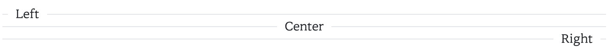
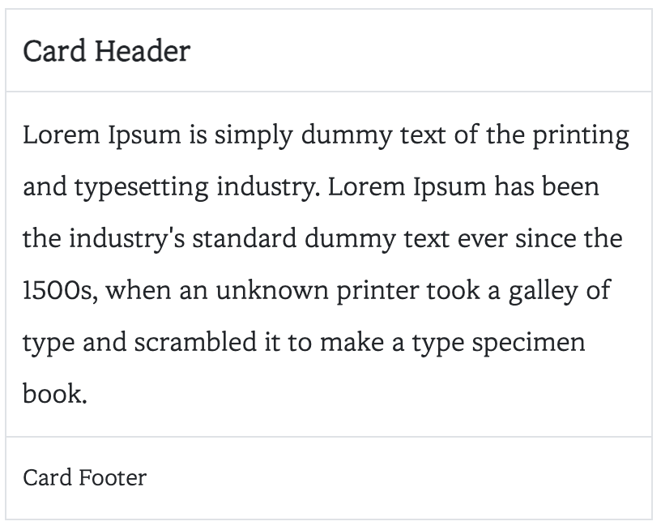

# Custom CSS Module

- 커스텀 CSS 모듈
- 이름 변경 예정 (TODO)

# Document

## Button Component

버튼 컴포넌트를 생성할 때는 `.btn` 을 반드시 추가하여 함

### Button Color

버튼은 아래 3가지를 지원한다.

- `.btn-primary`: Primary 색상의 버튼
- `.btn-secondary`: Secondary 색상 버튼
- `.btn-default`: 테두리만 있는 버튼

**Sample**


```html
<button class="btn btn-md btn-primary">Primary Color</button>
<button class="btn btn-md btn-secondary">Secondary Color</button>
<button class="btn btn-md btn-default">Default Button</button>
```

### Button Size

버튼 사이즈는 3가지를 지원한다.

- `.btn-sm`: 가장 작은 크기
- `.btn-md`: 중간 크기
- `.btn-lg`: 가장 큰 크기

**Sample**


```html
<button class="btn btn-sm btn-default">Small Button</button>
<button class="btn btn-md btn-default">Medium Button</button>
<button class="btn btn-lg btn-default">Large Button</button>
```

### Button Group

여러개의 `.btn` 을 `.btn-group` 으로 감싸서 그룹화 할 수 있다.

**Sample**


```html
<div class="btn-group">
  <button class="btn btn-md btn-primary">Button1</button>
  <button class="btn btn-md btn-primary">Button2</button>
  <button class="btn btn-md btn-primary">Button3</button>
  <button class="btn btn-md btn-primary">Button4</button>
</div>
<br />
<div class="btn-group">
  <button class="btn btn-md btn-secondary">Button1</button>
  <button class="btn btn-md btn-secondary">Button2</button>
  <button class="btn btn-md btn-secondary">Button3</button>
</div>
<br />
<div class="btn-group">
  <button class="btn btn-md btn-default">Button1</button>
  <button class="btn btn-md btn-default">Button2</button>
  <button class="btn btn-md btn-default">Button3</button>
</div>
```

### Button Radius

버튼의 모서리를 `.btn-radius` 를 이용하여 둥글게 할 수 있다.

**Sample**


```html
<button class="btn btn-sm btn-primary btn-radius">Primary Small Color</button>
<button class="btn btn-md btn-secondary btn-radius">
  Secondary Medium Color
</button>
<button class="btn btn-lg btn-default btn-radius">Default Large Button</button>
```

## Typhography Component

### Typhography Size

텍스트의 크기는 6가지를 지원한다. (오른쪽으로 갈수록 작아짐)

- `.h1`, `.h2`, `.h3`, `.h4`, `.h5`, `.h6`

**Sample**


```html
<div class="h1">h1 h1 h1 h1</div>
<div class="h2">h2 h2 h2 h2</div>
<div class="h3">h3 h3 h3 h3</div>
<div class="h4">h4 h4 h4 h4</div>
<div class="h5">h5 h5 h5 h5</div>
<div class="h6">h6 h6 h6 h6</div>
```

### Typhography Color

텍스트의 색상은 총 6가지를 지원한다.

- `.text-primary`: Primary 색상
- `.text-secondary`: Secondary 색상
- `.text-info`: Info 색상
- `.text-success`: Success 색상
- `.text-warning`: Warning 색상
- `.text-danger`: Danger 색상

**Sample**


```html
<p class="text-primary">primary</p>
<p class="text-secondary">secondary</p>
<p class="text-success">success</p>
<p class="text-info">info</p>
<p class="text-warning">warning</p>
<p class="text-danger">danger</p>
```

### Typhography Weight

텍스트의 굵기는 3가지를 지원한다.

- `.text-thin`: 가장 얇은 텍스트
- `.text-regular`: 중간 텍스트
- `.text-bold`: 가장 두꺼운 텍스트

**Sample**


```html
<p class="text-thin">thin</p>
<p class="text-regular">regular</p>
<p class="text-bold">bold</p>
```

### Typhography Orientation

텍스트를 구분선이 있는 형태로 정렬할 수 있다.

- `.text-divide-left`: 구분선이 있는 왼쪽 정렬
- `.text-divide-center`: 구분선이 있는 가운데 정렬
- `.text-divide-right`: 구분선이 있는 오른쪽 정렬

**Sample**



```html
<div class="text-divide-left">
  <span>Left</span>
</div>
<div class="text-divide-center">
  <span>Center</span>
</div>
<div class="text-divide-right">
  <span>Right</span>
</div>
```

## Divider Component

### Divider

구분선은 3가지 종류를 지원한다.

- `.divide`: 기본 구분선
- `.divide-dash`: 대시 구분선
- `.divide-dot`: 점 구분선

**Sample**


```html
<p>Divde</p>
<div class="divide"></div>

<p>Divde Dash</p>
<div class="divide-dash"></div>

<p>Divde Dot</p>
<div class="divide-dot"></div>
```

## Card Component

### Card

카드는 3가지 영역으로 구분된다.

- `.card-header`: 카드의 제목 부분
- `.card-body`: 카드의 본문 부분
- `.card-footer`: 카드의 footer 부분

**Sample**



```html
<div class="card">
  <div class="card-header">Card Header</div>
  <div class="card-body">
    Lorem Ipsum is simply dummy text of the printing and typesetting industry.
    Lorem Ipsum has been the industry's standard dummy text ever since the
    1500s, when an unknown printer took a galley of type and scrambled it to
    make a type specimen book.
  </div>
  <div class="card-footer">Card Footer</div>
</div>
```

## Alert Component

### Alert Color

알림은 2가지 영역으로 구분된다.

- `.alert-title`: 알림의 제목 부분 (왼쪽)
- `.alert-content`: 알림의 내용 (오른쪽)

그리고, 색상은 6가지를 지원한다.

- `.alert-primary`: Primary 색상
- `.alert-secondary`: Secondary 색상
- `.alert-info`: Info 색상
- `.alert-success`: Success 색상
- `.alert-warning`: Warning 색상
- `.alert-danger`: Danger 색상

**Sample**


```html
<div class="alert alert-primary">
  <div class="alert-title">Primary</div>
  <div class="alert-content">Alert Primary</div>
</div>
<div class="alert alert-secondary">
  <div class="alert-title">Secondary</div>
  <div class="alert-content">Alert Secondary</div>
</div>
<div class="alert alert-info">
  <div class="alert-title">Info</div>
  <div class="alert-content">Alert Info</div>
</div>
<div class="alert alert-success">
  <div class="alert-title">Success</div>
  <div class="alert-content">Alert Success</div>
</div>
<div class="alert alert-warning">
  <div class="alert-title">Warning</div>
  <div class="alert-content">Alert Warning</div>
</div>
<div class="alert alert-danger">
  <div class="alert-title">Danger</div>
  <div class="alert-content">Alert Danger</div>
</div>
```
